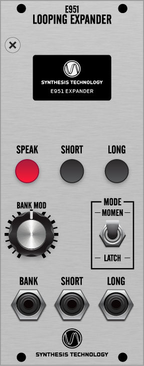

# SynthTech-E951
Design Materials for the Synthesis Technology E951 Looping Expander

## Abstract
The Synthesis Technology E951 Looping Expander is an auxilliary module that
provides access to additional functionality of the E950 Circuit-Bent VCO. It
uses a simple 3.3V logic-level asynchronous serial interface to the E950 to
enable looping of speech, CV control of speech banks and provides a text and
visual indication of the speech and waveform information.

Over the life of the E950 and E951 modules there were more E950s manufactured
so there are likely a lot of lonely E950s out in the wild. It's hoped that with
the release of this design information that some of them will find partners.

## Firmware
This directory provides all the source code scripts and vendor libraries needed
to recreate the E951 binary firmware. 

